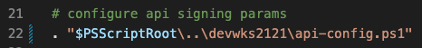
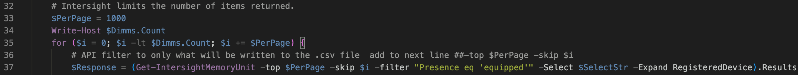

Yee Ha! You done made it to Amsterdam and the Datacenter API Rodeo! Strap on
your spurs and grab your 10 gallon hat, because you are in for a rootin'
tootin' good time.


Let's start by logging into Intersight and getting a lay of the land.

Scenario 1 -- Intersight organization and the API Browser

Open a browser and go to <https://intersight.com> you can log in with:

Username = <devwks.X@gmail.com> Where "X" is you laptop/lab number

Password = C!sco.123

If I was on laptop 1 I would use <devwks.1@gmail.com> as my username.

Open another tab and go to <https://intersight.com/apidocs> You will
notice that when you open the "apidocs" page your lab username will show
in the top right corner:


The "Guides" tab has useful information for ranch hands that like to
RTFM, but you are running a lab and nobody got time for that.

The "Downloads" tab shows all of the ways you can interact with
Intersight. In this lab we will use the native API Browser, Postman, and
some Python. Feel free to check out the other methods and resources when
you are not on the boss's clock.

Go to the "API Reference" tab to access the native Intersight API
browser:


All of the available API calls are on the left side of the browser. In
this lab we are setting up an enterprise deployment of Intersight which
means we need to look at the Organizations. Since you are new in these
parts, you may not know what an Organization is. You can head on over to
the Intersight Help Center to read more:
<https://intersight.com/help/saas/faqs#organizations_and_roles_in_intersight>

Again reading docs is hard, here is a pretty picture:


Lets start by looking at the Organizations that have been created. On
the API browser tab, go to the search box on the left and type:

```Org```

You will see the options on the left filter down to anything that has
"org" in it. Expand the "organization/Organizations" section and select
the GET call for "Read a 'organization.Organization' resource."


Click the "Send" button to run this API request against your Intersight
account:


You will now see a JSON output of all the Organizations in the account
and their associated properties. There is a lot of information here and
we want to narrow it down to the things that will help us to make sense
of the environment.

In the API browser we can see the parameters that we can apply to the
GET call to change the JSON output. Let's start by only grabbing the
fields we want to see using the \$select query.

On the right side of the API browser hit the "+ Query Paramater" and add
the Key '\$select' and the Value 'Name,Description' then hit "Send" to
see the results:


There is not much going on the at the ranch as all we can see is the
"default" organization. Time to get to work and create some orgs!

Since creating an Org is fairly simple we are going to stick with the
API Browser.

On the left select the POST to create an organization


In the REST Client add these values into the text box:

```
{
    "Name":  "Pod1",
    "Description": "Pod 1 Organization"
}
```


Where the Pod = your pod number. Hit Send to create the Org.

Notice in the Response Text of your new Org values for the "Moid" and
"Resource Groups"


The Moid will need to be used for any modifications to the Org.

The Organization is a top level container where we can apply Intersight
RBAC and overall policies, but we will need to create Resource Groups
and then add the physical devices to the Resource Groups. Things are
getting a little hairy for the API Browser, so lets move over to
Postman!


Open Postman and there should be an Intersight Collection on the left
and an environment for Intersight on the right. Make sure both are
selected.


For this lab I have already created an API key and configured it in the environment.  To see the key go back to the main Intersight.com site, ensure that the dropdown shows "System", select "Settings" on the left, scroll down and select to "API Keys" on the menu.


You should see the already generated "LabGod" key.  The API Key ID is visable but the secret-key is only available when generating a new key.    


We can see the key by going back to Postman, click the
"environment quick look" icon to the right of the Intersight environment:


You can now see the api-key-id and secret-key values.  


We can test the Postman config by selecting the "GET NTP Policy", hit "Send" and
hopefully getting a "200 OK" response


Now we are ready to roll with adding a Resource Group to an
Organization. In the lab I have created two resource groups that you
will need to add to your newly created organization.

PodX-Denver

PodX-Dallas

In order to add these to your Organization we will first need to
determine their Moid. On the left menu you will see a folder for DevWks
2121, under that folder select "GET Resource Group Info", then hit the
"Send" button


With a successful run there should be a lot of JSON output in the
results. We need to add some parameters to filter down the output. Click
the "search" icon, then type "Pod" in the search field. You should now
see output similar to below:


We know that the "Name" field will contain the common name of our
Resource Group, and we will need the "Moid" value to edit the
Organization. Lets add some paramaters to the GET to filter down the
output.

On the "Params" tab enter the following:


Key

```$select```

Value
 
```Name,Moid,Organizations```

Hit send and you will see that the output is returning the "Name",
"Moid", and "Organizations" fields, along with a couple of standard
fields.

We still need to narrow this output down to our specific Pod. To do this
add:

Key  

```$filter```

Value

```contains(Name,'PodX')```

Where "X" is your pod number.


Hit Send again and you should now only see the resource groups assigned
to your pod. Make note of the Moid associated with each Resource Group,
we will need to use this when adding them to the Org.

We are finally here, the moment where we add the Resource Groups to your
newly created Organization!


On the left click, "GET Organization Moid" edit your Pod \# in the
\$filter value, and run the call:


From the output, copy your Organization Moid value.

On the left select, "PATCH Organization", then add the Organization Moid
to the PATCH URL, and add the Resource Group Moid's to the Body, and hit


If that magic 200 OK shows up you should see that your Organization now
has two resource groups assigned:


You can now re-run the GET Organization Moid call and see that the resource groups have been assigned.

Congratulations you are no longer a greenhorn on the Intersight API
ranch!


**Scenario 2 -- Keeping track of the Server herd**

Now its time to stop some dirty varmints that are messing with our
servers. We need to get details about the RAM in our servers. Lets start
in Postman and explore the GET Memory Units call.

On the left select GET Memory Units and click Send:


  

Looking at the JSON output we need to get and idea of the number of
results. Line 1-99 show the information for 1 DIMM. If you scroll down
through the JSON we can see that there are 9467 lines of output. This means we are only seeing \<100 DIMMs.

Take a look at the "Registered Device" field.


The "Registered Device" field is referencing the "DeviceRegistrations" model, but it is only returning the Moid of the device.  That doesn't really help.  We will get back to this in just a bit.  
  
We need to expand the scope of our query by using the \$top command. We
need to add:

Key

```$top```

Value

```1000```


Hit Send and see how the JSON output changes.

Now there are 94817 lines of output, but we know there are more than
1000 DIMMs on the ranch.  The math isn't adding up...

Go back to the call and add:

Key

```$inlinecount```

Value

```allpages```


Now on the third line of output we can see there are >30000 records
available


Unfortunately the Intersight API is limited to a response of 1000
records at a time. 

Postman isn't going to cut it for this task, its time
to bring in every server admins favorite tool.....


Your desktop should already have PowerShell installed and configured. If
you were doing this at on your own you could get the PowerShell modules
from: <https://intersight.com/apidocs/downloads/>

Open Visual Studio Code

If the folder is not already open, hit the file menu and select "open folder", navigate to devwks2121 folder and hit "Open"


You should now see


Lets start by looking at authentication. Click on "api-config.ps1" to
see the authentication script.

Authentication to Intersight is already set up using an existing api
key.

**This lab follows the "allow ip any any" rule of security.  You should probably do better in real life.  You have been warned.**


Now that we have seen the basic authentication, we can take a look at
the script and compare to the API information.

Select "dim-serials_beginning.ps1 on the left of the screen.

You will see that line 21-22 define our authentication using
api-config.ps1:



Line 27-31 should look pretty familiar to our PostMan GET Memory Units
call:


Lets go back to PostMan to see what information this script will pull.
You should already have

\$top 1000

\$inlinecount allpages

Now we just need to add

Key

```$filter``` 

Value

```Presence eq 'equipped'```

Key

```$select```

Value

```Location,Presence,Serial,Model,Dn,RegisteredDevice```


Hit Send and take a look at the results:


We still have 37448 devices, and "RegisteredDevice" is only pulling a
Moid from asset DeviceRegistration. Lets go back to the script and take
a look at the rest.

Line 37 has our \$filter and \$select keys, but there is also a key that
is commended out.


Lets change this line to add this additional key:


We can also go back to Postman and add:

Key

```$expand```

Value

```RegisteredDevice```

Hit send in Postman to see the new results:


Now under "RegisteredDevice" we are seeing many more fields that are
tied back to the info from asset. Search for the Moid on the original
request, should be:

```628818726f72612d39e9d6dc```

We can see the the Moid ending in 6dc, is tied to the "DeviceHostname"
of "Pod2-Denver" which is more human readable than the Moid. This type
of cross-referencing between API classes happens throughout Intersight
and can be a real...nice feature to deal with in
grabbing the right information.

Back in our PowerShell script we can see how we can display the human
readable DeviceHostname instead of the Moid.

Line 39-45 address this:


Take away the "##" to add this to our script, with the output looking
like this:


Just for kicks and giggles lets try and run the script as it is. In the
terminal window in VSCode, enter, ./dimm-serials_beginning.ps1 and hit
enter


Our script starts off and sees the total count of devices, but due to
the API restrictions of 1000 records we see the error. We need to add a
loop to make the request until it has grabbed all of the items.

Lines 32-37 handle this:


Line 33 creates a variable that sets the equivalent of the \$top key in
our API and also gives us a number to increment the loop. Remove the
comments on line 33 to create this variable.

Line 35 creates our loop by creating the \$i variable that increments by
1000 until it reaches a number equal to the total count which in our
case is 37448. Remove the comments on line 35 and add "-top \$PerPage
-skip \$i to line 37 like this:



Also remove the comment on line 48 to add our closing '}'

Hit Ctrl-S to save our work and re-run the script in the Terminal

Now the script runs without error, but it seems to sit here:


Lets add a nice little progress indicator by incrementing every 1000
results that are gathered. Take a look at line 38:


Remove the comments and now we will post a status every time \$i
increments by 1000.

Hit Ctrl-S and re-run the script for the final time, with increments:


You can let the script finish, or hit Ctrl-c to stop it early. Either
way the "Dev2121_dimm_serial_summary.csv" file is created and will have
results.

**Super European Bonus Round!**

How can you change this script to only pull the DIMMs in PodX-Denver and
Dallas?

Congratulations on finishing Devwks-2121 and being the best ranch hand
in this roundup! Now get back to your ranch and show them servers who is
the boss!


